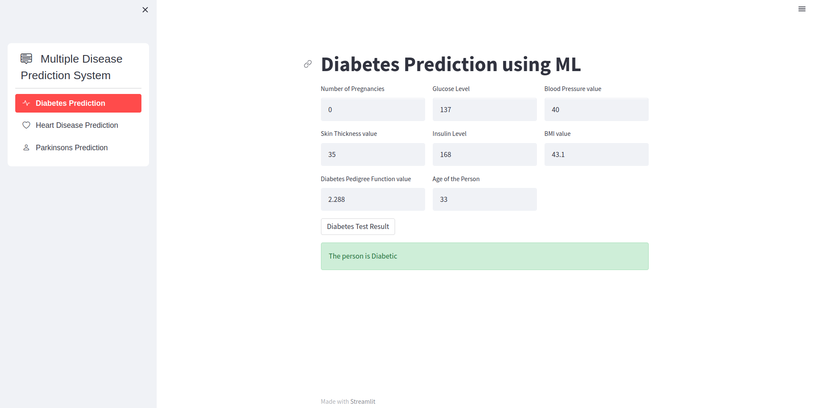
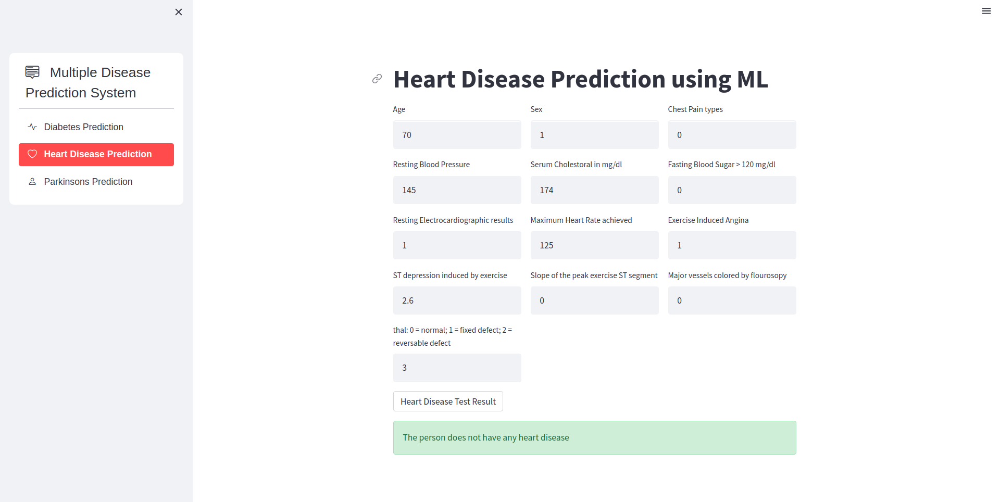
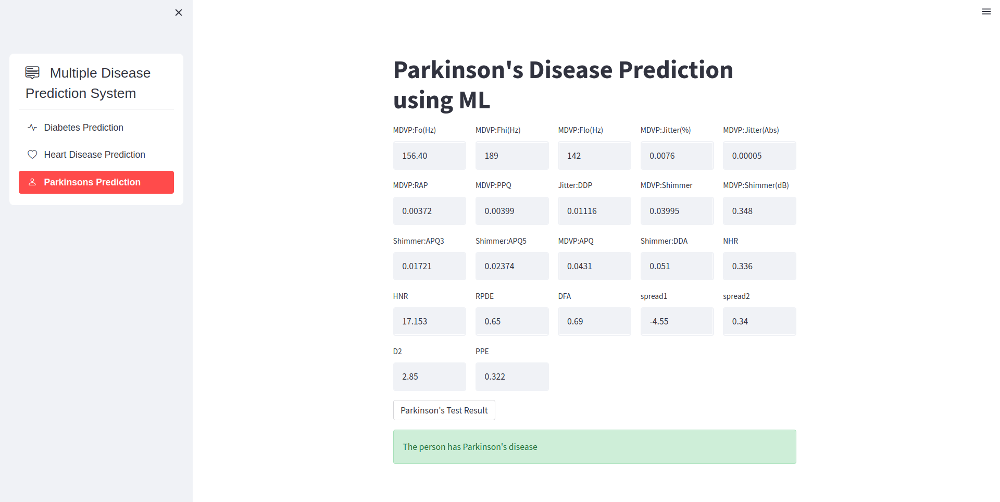

# DiagnoCareHub
DiagnoCareHub is ML-based web app which diagnoses patients from disease like Parkinson, Diabetes, Heart disease, etc.

Link to web app  : [https://diagnocarehub.onrender.com](https://diagnocarehub.onrender.com)

The diseases predicted by the web app include :
- Diabetes
- Heart Disease
- Parkinsons Disease

**Languages Used :**

 

**Libraries Used :** 

- Numpy 
- Pandas
- Scikit-Learn 
- Streamlit

The Web App was made with [Streamlit](https://streamlit.io/) and Deployed on [Render](https://www.render.com/)

---

### Diabetes Prediction :
- Dataset used : [Pima Indians Diabetes Database](https://www.kaggle.com/datasets/uciml/pima-indians-diabetes-database)
- Machine Learning Model : Support Vector Machine with linear function kernel

---

### Heart Disease Prediction :
- Dataset used : [UCI Heart Disease Dataset](https://www.kaggle.com/datasets/redwankarimsony/heart-disease-data)
- Machine Learning Model : Logistic Regression

---

### Parkinsons Disease Prediction :
- Dataset used : [Parkinsons Data Set](https://www.kaggle.com/datasets/nidaguler/parkinsons-data-set)
- Machine Learning Model : Support Vector Machine with radial basis function kernel

---

## Installation

1. Clone the repository:
`https://github.com/Keraskp/DiagnoCareHub.git`

2. Navigate to the project directory:
`cd DiagnoCareHub/`

3. Create a virtual environment (optional but recommended):
`python3 -m venv venv`

4. Activate the virtual environment:
`source venv/bin/activate`

5. Install the required dependencies:
`pip install -r requirements.txt`

To run the application, execute the following command:
`streamlit run app.py`

This will start the web app locally, and you can access it by visiting `http://localhost:8501` in your web browser.

## Usage

1. Select the disease you wish to predict (Diabetes, Parkinson's, or Heart Disease) by using the provided navigation tabs.
2. Fill in the necessary information in the input fields provided. Include relevant details such as age, gender, blood pressure, glucose level, etc.
3. Click on the "Predict" button to initiate the prediction process.
4. After a brief processing period, the app will display the results, including the likelihood of having the selected disease.

## Contributions

Contributions to this project are welcome. If you encounter any issues or have suggestions for improvement, please feel free to submit a pull request or open an issue in the project repository.

## License

This project is licensed under the [MIT License](LICENSE).

## Disclaimer

The salary predictions provided by this web application are estimates based on historical data. Actual salaries may vary depending on a variety of factors not accounted for in the model. The application is intended for informational purposes only, and the developers are not responsible for any decisions made based on the predicted salary values.

---